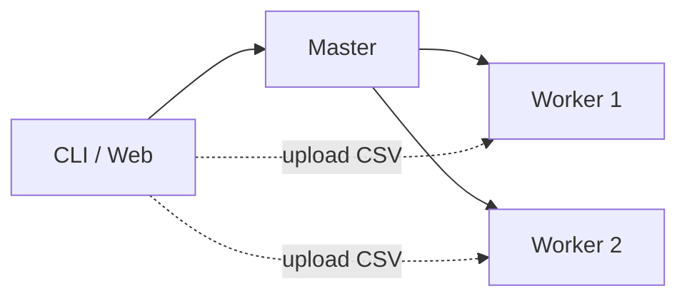

# Distributed MapReduce (Python / FastAPI)

Навчальний прототип розподіленої системи обробки CSV-даних у парадигмі **MapReduce**. Кластер складається з координатора (**Master**) та вузлів-виконавців (**Worker**), що взаємодіють через REST API. Підтримуються спрощені агрегації (sum, max, mean, count) і повноцінний MapReduce з користувацькими Python-скриптами.

## Можливості

- Архітектура **Master–Worker** з горизонтальним масштабуванням (додавання воркерів)
- Завантаження CSV із розподілом фрагментів між воркерами
- Два режими MapReduce:
  - **Спрощений** — агрегація по колонці (`sum`, `max`, `mean`, `count`) та довільні вирази mapper/reducer
  - **Повноцінний** — `mapper.py` / `reducer.py` з функціями `map_row` та `reduce_group`
- Детермінований **Shuffle** (hash-партиціонування ключів)
- **CLI** для роботи з кластером
- **Веб-панель** управління на Master
- Розгортання через **Docker Compose**

## Архітектура



| Компонент | Порт | Призначення |
|-----------|------|-------------|
| `master` | 8000 | Реєстр воркерів, метадані файлів, оркестрація MR |
| `worker1` | 8001 | Зберігання фрагментів, Map / Shuffle / Reduce |
| `worker2` | 8002 | Зберігання фрагментів, Map / Shuffle / Reduce |

## Вимоги

- [Docker](https://docs.docker.com/get-docker/) 20.10+ та Docker Compose 2.0+
- Для локального CLI без Docker: Python 3.10+, залежності з `requirements.txt`

## Швидкий старт

```bash
# Клонування (після публікації на GitHub)
git clone <url-репозиторію>
cd dist_mapreduce

# Запуск кластера
docker compose up --build -d

# Перевірка
docker compose ps
curl http://localhost:8000/
```

Після старту:

- Master API: http://localhost:8000  
- Worker 1: http://localhost:8001  
- Worker 2: http://localhost:8002  
- Веб-панель: http://localhost:8000/dashboard  

Зупинка:

```bash
docker compose down
```

## CLI

### Консоль за методичкою

```bash
pip install -r requirements.txt

# Завантажити CSV на кластер
python my_cluster_console_tool.py --send test.csv

# Зчитати файл з кластера
python my_cluster_console_tool.py --read test.csv -o merged.csv

# MapReduce з власними скриптами
python my_cluster_console_tool.py \
  --map-reduce test.csv \
  --mapper examples/mapper_price_sum.py \
  --reducer examples/reducer_sum.py \
  --results output.csv
```

Змінна `MASTER_URL` (за замовчуванням `http://localhost:8000`) задає адресу Master.

### Розширений CLI

```bash
python client/cli.py status
python client/cli.py upload test.csv
python client/cli.py read test.csv -o merged.csv
python client/cli.py mapreduce-py test.csv \
  --mapper examples/mapper_price_sum.py \
  --reducer examples/reducer_sum.py \
  --results output.csv
```

## Приклад mapper / reducer

**mapper** (`examples/mapper_price_sum.py`):

```python
def map_row(row):
    try:
        price = float(row.get("price", 0) or 0)
    except (TypeError, ValueError):
        price = 0.0
    return [("__all__", price)]
```

**reducer** (`examples/reducer_sum.py`) — функція `reduce_group(key, values)` повертає агреговане значення для ключа.

## Структура проєкту

```
dist_mapreduce/
├── master/
│   ├── main.py              # Master API, оркестрація MR
│   └── static/index.html    # Веб-панель
├── worker/
│   └── main.py              # Worker API, Map / Shuffle / Reduce
├── client/
│   ├── cluster_ops.py       # Високорівневі операції з кластером
│   └── cli.py               # Розширений CLI
├── examples/
│   ├── mapper_price_sum.py
│   └── reducer_sum.py
├── my_cluster_console_tool.py
├── docker-compose.yml
├── Dockerfile
└── requirements.txt
```

## API (коротко)

**Master:** `GET /`, `POST /register`, `POST /record_fragment`, `GET /metadata`, `POST /run-map`, `POST /run-shuffle`, `POST /run-reduce`, `POST /mr/*`, `GET /dashboard`

**Worker:** `POST /upload`, `GET /download`, `POST /map`, `POST /mr/map`, `POST /mr/shuffle-forward`, `POST /mr/shuffle-ingest`, `POST /mr/reduce`, …

Детальний опис ендпоінтів — у курсовій документації або в коді `master/main.py` та `worker/main.py`.

## Автор

Курсова робота, ПМІ-32, ЛНУ імені Івана Франка.
